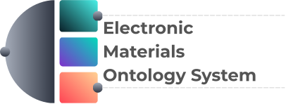

# EMOS - Electronics Materials Operating System

🌐 **Live Site**: https://aprilaihub.github.io/EMOS

<picture>
  <source media="(prefers-color-scheme: dark)" srcset="images/logo_name_dark.svg">
  <source media="(prefers-color-scheme: light)" srcset="images/logo_name.svg">
  
</picture>

## PROJECT OVERVIEW

EMOS is an open-source platform for electronics materials science research. Access integrated databases, AI-powered analysis, and computational tools for materials exploration and electronic device design.

## QUICK START

### Prerequisites
- Modern web browser (Chrome, Firefox, Safari, Edge)
- Python 3.8+ (for backend)

### Installation

**Option 1: Automated Setup (Recommended)**
```bash
git clone https://github.com/aprilaihub/EMOS.git
cd EMOS
bash setup/setup.sh          # macOS/Linux
# or
setup\setup.bat              # Windows
```

Then activate the virtual environment:
- macOS/Linux: `source emos_env/bin/activate`
- Windows: `emos_env\Scripts\activate.bat`

**Option 2: Manual Setup**
```bash
git clone https://github.com/aprilaihub/EMOS.git
cd EMOS
python -m venv emos_env
source emos_env/bin/activate  # macOS/Linux
pip install -r requirements.txt
```

See [setup/README.md](setup/README.md) for more details.

### Run Locally

**Frontend:**
```bash
python -m http.server 8000
# Visit http://localhost:8000
```

**Backend:**
```bash
cd backend
python app.py
# Runs on http://localhost:5000
```

> **Note**: The Python backend server runs automatically on your local machine. On the live website, it runs automatically on Render.

## PROJECT STRUCTURE

```
EMOS/
├── index.html                    # Main application interface
├── script.js                     # JavaScript functionality & feature loading
├── styles.css                    # Application styling
├── requirements.txt              # Python dependencies
│
├── Features/                     # Feature implementations
│   ├── Materials_Exploration/   # Materials science features
│   ├── Electronics_Application/ # Electronics application tools
│   └── FeatureFactory.py        # Feature loader and manager
│
├── Information_Units/           # Data sources & computational tools
│   ├── Databases/               # Material property databases
│   ├── Generators/              # Material generation tools
│   └── Predictors/              # Property prediction models
│
├── backend/                     # Flask backend server
│   └── app.py                   # Flask API routes
│
├── docs/                        # Documentation (Sphinx)
│   ├── DOCUMENTATION.md         # Documentation framework guide
│   └── conf.py, index.rst, ...
│
├── devtools/                    # Development tools
│   └── ui_data.json             # Component definitions
│
└── images/                      # Graphics and logos
```

## TECHNOLOGY STACK

- **Frontend**: HTML5, CSS3, JavaScript (ES6+)
- **Backend**: Python, Flask
- **Architecture**: Modular component-based structure
- **Documentation**: Sphinx with Read the Docs theme
- **UI/UX**: Responsive design with glassmorphism effects

## NEXT STEPS

- **Contributing**: See [CONTRIBUTING.md](CONTRIBUTING.md) for how to add features and information units
- **Documentation**: Explore detailed docs in [docs/DOCUMENTATION.md](docs/DOCUMENTATION.md)
- **GitHub**: https://github.com/aprilaihub/EMOS

## LICENSE

Licensed under the MIT License - see [LICENSE](LICENSE) file for details.
